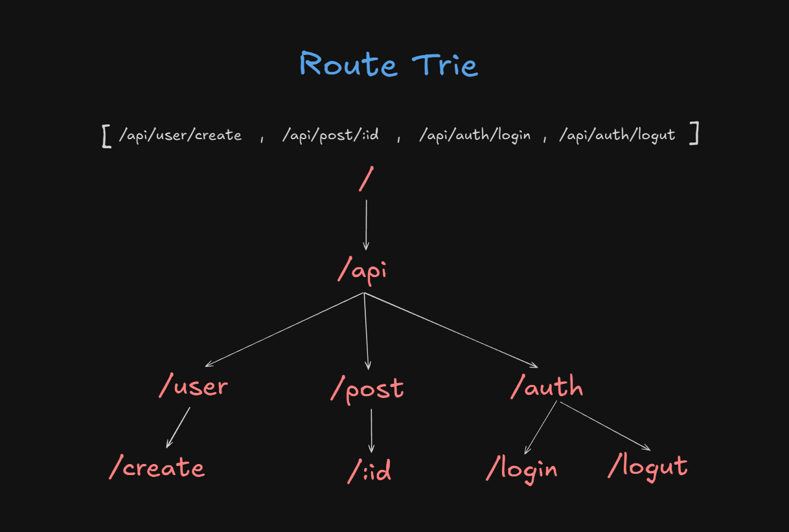

# Signal

A lightweight, modern web framework built on Web Standards. Signal uses the native Fetch API and comes with built-in Zod validation, CORS support, and an intuitive routing system.

## Features

- **Web Standards** - Built on top of the standard Fetch API
- **Type Safe** - Full TypeScript support out of the box
- **Built-in Validation** - Easy request validation using Zod schemas
- **CORS Support** - Configure CORS with a simple method call
- **Cookie Management** - Set, get, and clear cookies easily
- **Middleware Support** - Global and route-level middleware
- **Dynamic Routing** - Support for URL parameters
- **Clean API** - Simple and intuitive methods for building APIs

## Why Signal is Fast

Signal uses a **Trie (prefix tree) data structure** for route matching, making it significantly faster than traditional frameworks like Express.

### How Traditional Routing Works (Express)

Express checks routes **one by one** in the order you define them:

```typescript
// Express has to check each route sequentially
app.get('/users', ...)           // Check 1
app.get('/users/:id', ...)       // Check 2
app.get('/posts', ...)           // Check 3
app.get('/posts/:id', ...)       // Check 4
app.get('/posts/:id/comments'...)// Check 5
```

**Problem:** If you have 100 routes and your request matches the 100th route, Express has to check all 99 routes before finding the right one. This is **O(n)** complexity - it gets slower as you add more routes.

### How Signal's Trie Routing Works

Signal builds a **tree structure** from your routes, allowing instant lookups:



Instead of checking routes one by one, Signal:
1. **Splits the URL** into segments: `/users/123/posts` → `["users", "123", "posts"]`
2. **Traverses the tree** following the path: `root → users → :id → posts`
3. **Finds the match** in constant time based on the number of URL segments

**Benefits:**
- ✅ **Constant time lookup** - O(k) where k is the number of segments in the URL (typically 2-5)
- ✅ **No wasted checks** - Never looks at routes that don't match the current path
- ✅ **Scales efficiently** - Adding more routes doesn't slow down existing routes
- ✅ **Smart parameter handling** - Dynamic segments (`:id`) are handled naturally in the tree

**Real-world impact:**
```
Express with 100 routes:  1-100 checks per request
Signal with 100 routes:   2-5 checks per request (based on URL depth)

Express with 1000 routes: 1-1000 checks per request  
Signal with 1000 routes:  2-5 checks per request (same speed!)
```

Signal's routing speed **doesn't degrade** as your application grows, making it ideal for large APIs with hundreds of endpoints.

## Installation

### npm (Node.js)
```bash
npm install @dipan2003/signal
```

### Bun
```bash
bun add @dipan2003/signal
```

### Deno
```typescript
import { Signal } from "npm:@dipan2003/signal";
```

## Quick Start

```typescript
import { Signal } from '@dipan2003/signal';

const app = new Signal();

export default app;
```


## CORS Configuration

Signal provides flexible CORS configuration with support for multiple origins, custom validation, and credentials.

```typescript
import { app } from '@lib/signal';


// Basic CORS - allow all origins
app.cors({
    origin: '*',
    methods: ['GET', 'POST', 'PUT', 'DELETE', 'PATCH'],
    headers: ['Content-Type', 'Authorization'],
    credentials: false,
    maxAge: 86400, // 24 hours in seconds
});

// Specific origin
app.cors({
    origin: 'https://example.com',
});

// Multiple origins
app.cors({
    origin: ['https://app.example.com', 'https://admin.example.com'],
});

// Dynamic origin validation
app.cors({
    origin: (requestOrigin) => {
        // Custom logic to validate origin
        return requestOrigin?.endsWith('.example.com') || false;
    },
});

// With credentials (cookies, authorization headers)
app.cors({
    origin: 'https://app.example.com',
    credentials: true, // Required for cookies/auth
});
```

### CORS Options

| Option | Type | Default | Description |
|--------|------|---------|-------------|
| `origin` | `string \| string[] \| function` | `'*'` | Allowed origins. Use `'*'` for all, array for multiple, or function for custom logic |
| `methods` | `string[]` | `['GET', 'POST', 'PUT', 'DELETE', 'PATCH']` | Allowed HTTP methods |
| `headers` | `string[]` | `['Content-Type', 'Authorization']` | Allowed request headers |
| `credentials` | `boolean` | `false` | Allow credentials (cookies, authorization headers) |
| `maxAge` | `number` | `86400` | Preflight cache duration in seconds |

### Important Edge Cases

**⚠️ Credentials + Wildcard Origin**
```typescript
// ❌ This will NOT work - browsers reject wildcard with credentials
app.cors({
    origin: '*',
    credentials: true,
});

// ✅ Use specific origin(s) instead
app.cors({
    origin: 'https://app.example.com',
    credentials: true,
});
```

**⚠️ Origin Validation**
- If the request origin doesn't match your configuration, CORS headers won't be set
- Preflight OPTIONS requests are automatically handled and return 204
- The `Vary: Origin` header is set when origin is allowed (important for caching)

**⚠️ Custom Headers**
```typescript
// If your app uses custom headers, add them to the allowed list
app.cors({
    headers: ['Content-Type', 'Authorization', 'X-Custom-Header'],
});
```


## Middleware

```typescript
// Global middleware
app.use(async (c, next) => {
  console.log(`${c.req.method} ${c.req.path}`);
  await next();
});

// Path-specific middleware
app.use('/api', async (c, next) => {
  // runs for all /api/* routes
  await next();
});
```

## Routing

Signal uses a flexible routing system that allows you to organize your routes and handle HTTP methods easily.

### Basic Usage

```typescript
import { app } from '@lib/signal';


const router = app.router();

// Define routes
router.GET('/users', async (c) => {
    return c.res.json({ users: [] });
});

router.POST('/users', async (c) => {
    return c.res.json({ message: 'User created' });
});

router.PUT('/users/:id', async (c) => {
    const { id } = c.req.params;
    return c.res.json({ message: `User ${id} updated` });
});

router.DELETE('/users/:id', async (c) => {
    const { id } = c.req.params;
    return c.res.json({ message: `User ${id} deleted` });
});
```

### Supported HTTP Methods

- `GET` - Retrieve resources
- `POST` - Create resources
- `PUT` - Update resources (full replacement)
- `PATCH` - Update resources (partial update)
- `DELETE` - Delete resources

### Dynamic Routes

Use `:paramName` syntax for URL parameters:

```typescript
router.GET('/users/:id', async (c) => {
    const { id } = c.req.params;
    return c.res.json({ userId: id });
});

router.GET('/posts/:postId/comments/:commentId', async (c) => {
    const { postId, commentId } = c.req.params;
    return c.res.json({ postId, commentId });
});
```

## Request Validation

Signal provides automatic request validation using Zod schemas. When validation fails, Signal automatically sends an error response to the client. When validation succeeds, the parsed and sanitized data is available at `c.req.body`.

### How it Works

1. **Define a Schema** - Create a Zod schema for your expected request body
2. **Apply Validation** - Use `app.validate(schema)` as middleware
3. **Access Validated Data** - Get type-safe, validated data from `c.req.body`

### Basic Example

```typescript
import { Context } from '@dipan2003/signal';
import app from "@lib/signal"
import { z } from 'zod';


const router = app.router();

// 1️⃣ Define your schema
const userSchema = z.object({
    name: z.string(),
    email: z.string().email(),
    age: z.number().min(18).optional(),
});

// 2️⃣ Apply validation middleware
router.POST('/users', app.validate(userSchema), async (c: Context) => {
    // 3️⃣ Access validated data - already parsed and type-safe!
    const data = c.req.body; // TypeScript knows this matches userSchema
    
    return c.res.json({ 
        message: 'User created', 
        data 
    });
});
```

### What Happens During Validation

**✅ Success Case:**
```typescript
// Request body: { "name": "John", "email": "john@example.com" }

router.POST('/create', app.validate(userSchema), async (c: Context) => {
    const data = c.req.body;
    // data = { name: "John", email: "john@example.com" }
    // ✅ Data is validated, sanitized, and type-safe
    
    return c.res.json({ message: 'Success', data });
});
```

**❌ Failure Case (Automatic Error Response):**
```typescript


router.POST('/create', app.validate(userSchema), async (c: Context) => {
    // ⚠️ This handler is NEVER reached
    // Signal automatically sends this response:
    
    // Status: 400
    // {
    //   "error": "Validation failed",
    //   "issues": [
    //     {
    //       "field": "email",
    //       "message": "Invalid email"
    //     }
    //   ]
    // }
});
```

### Advanced Validation Examples

```typescript
// Complex nested schema
const createPostSchema = z.object({
    title: z.string().min(1).max(200),
    content: z.string(),
    tags: z.array(z.string()).optional(),
    author: z.object({
        name: z.string(),
        email: z.string().email(),
    }),
    published: z.boolean().default(false),
});

router.POST('/posts', app.validate(createPostSchema), async (c: Context) => {
    const post = c.req.body;
    // post is fully validated and typed
    
    return c.res.json({ message: 'Post created', post });
});

// Multiple validations
router.PUT(
    '/users/:id',
    app.validate(updateUserSchema),
    async (c: Context) => {
        const { id } = c.req.params;
        const updates = c.req.body;
        
        return c.res.json({ 
            message: `User ${id} updated`, 
            updates 
        });
    }
);
```

### Key Features

- **Automatic Error Handling** - No need to manually check validation results
- **Type Safety** - `c.req.body` is typed based on your schema
- **Data Sanitization** - Zod transforms and cleans data automatically
- **Clear Error Messages** - Clients receive detailed validation errors
- **JSON Validation** - Automatically parses and validates JSON request bodies

### Important Notes

- Validation middleware **must** come before your route handler
- If validation fails, your route handler **will not execute**
- Invalid JSON bodies return a 400 error automatically
- Validated data is always available at `c.req.body`, not `c.res.body`


## Cookies

```typescript
// Set a cookie
router().GET('/set-cookie', async (c) => {
  c.res.cookie('session', 'abc123', {
    httpOnly: true,
    secure: true,
    maxAge: 3600,
  });
  return c.res.text('Cookie set');
});

// Get a cookie
router().GET('/get-cookie', async (c) => {
  const session = c.req.cookie('session');
  return c.res.json({ session });
});

// Clear a cookie
router().GET('/clear-cookie', async (c) => {
  c.res.clearCookie('session');
  return c.res.text('Cookie cleared');
});
```

## Error Handling

Signal provides a global error handler to customize how your application responds to errors. By default, if an error occurs and is not caught, Signal returns a generic 500 response. Use `app.onError()` to customize this behavior.

### What does it do?
- Catches any unhandled errors that occur in your routes or middleware
- Allows you to customize the error response sent to the client
- Provides access to the error object and request context

### When to use it?
- **Custom error responses** - Return user-friendly error messages instead of generic ones
- **Error logging** - Send errors to logging services (Sentry, LogRocket, etc.)
- **Different error formats** - Return JSON for APIs, HTML for web pages
- **Security** - Hide sensitive error details in production

### How to use it

```typescript
// Basic error handler
app.onError((err, c) => {
  console.error(err);
  return c.res.status(500).json({ 
    error: 'Something went wrong' 
  });
});


app.onError((err, c) => {
  // Handle different error types
  if (err instanceof ValidationError) {
    return c.res.status(400).json({ error: err.message });
  }
  
  if (err instanceof NotFoundError) {
    return c.res.status(404).json({ error: 'Resource not found' });
  }
  
  // Default error
  return c.res.status(500).json({ error: 'Internal Server Error' });
});

// With external logging service
app.onError((err, c) => {
  // Log to external service
  logger.error({
    message: err.message,
    stack: err.stack,
    path: c.req.path,
    method: c.req.method,
  });
  
  return c.res.status(500).json({ 
    error: 'An error occurred. Our team has been notified.' 
  });
});
```

**Important Notes:**
- The error handler must **return a Response** (using `c.res.json()`, `c.res.text()`, etc.)
- If you don't set a custom error handler, Signal returns a default 500 response
- The error handler receives the error object and the Context

## Request Logging

```typescript
app.logRequests(); // Toggle request logging
```

## License

MIT

## Contributing

Contributions are welcome! Please feel free to submit a Pull Request.
